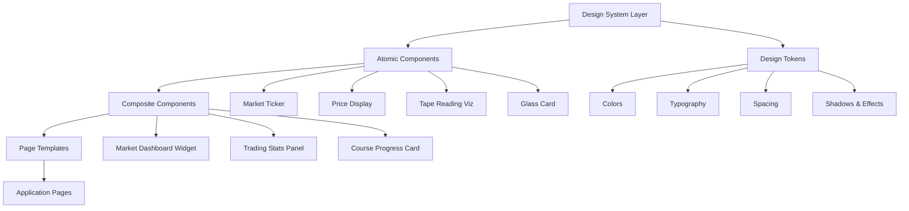
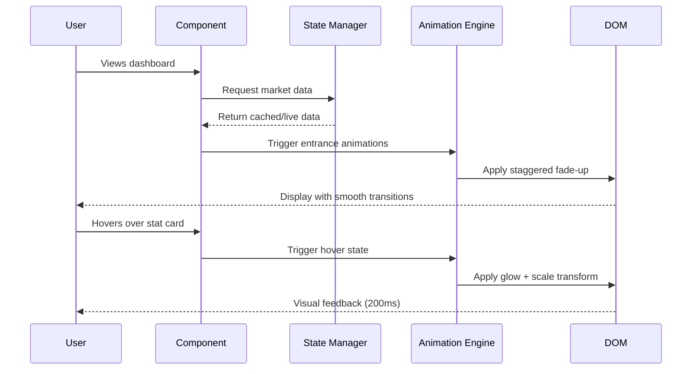
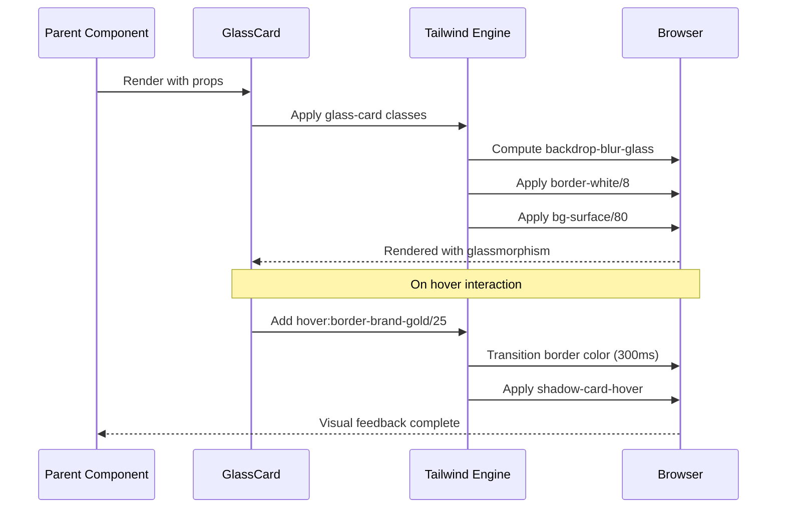

# Design Document: Visual Redesign - Financial Market Theme

## Overview

This design document outlines a comprehensive visual redesign of the Coast Academy course platform, transforming it into a premium financial market interface with professional dollar analysis and tape reading aesthetics. The redesign maintains the existing React 19 + TypeScript + Vite + TailwindCSS stack while introducing enhanced visual hierarchy, financial market-inspired UI components, improved glassmorphism patterns, and premium micro-interactions. The goal is to create an extremely functional, high-quality interface that reflects the professional standards of financial trading platforms while maintaining accessibility and responsive design principles.

The redesign leverages the existing dark theme (#0B0F14 base, #101720 surface) and gold branding (#C9A227), introducing new component patterns, enhanced typography systems, real-time market data visualizations, and sophisticated depth layering that elevates the platform to institutional-grade quality.

## Architecture

The visual redesign follows a layered component architecture that separates visual presentation from business logic, enabling reusability and maintainability across the platform.



### Architecture Principles

1. **Atomic Design Methodology**: Components organized from atoms (buttons, inputs) to molecules (cards, forms) to organisms (dashboards, layouts)
2. **Token-Based Theming**: All visual properties derived from centralized design tokens in TailwindCSS preset
3. **Glassmorphism Depth System**: Three-tier depth system (surface, elevated, overlay) with consistent backdrop blur and border treatments
4. **Financial Market Semantics**: Component naming and behavior patterns inspired by trading platforms (bid/ask, tape, ticker, order flow)
5. **Performance-First Animations**: GPU-accelerated transforms and opacity changes, avoiding layout thrashing

## Sequence Diagrams

### User Interaction Flow - Market Data Display



### Component Rendering Flow - Glassmorphism Card



## Components and Interfaces

### Component 1: MarketTicker

**Purpose**: Display real-time scrolling market data with financial market aesthetics (price, volume, bid/ask spread)

**Interface**:

```typescript
interface MarketTickerProps {
  items: MarketTickerItem[];
  speed?: 'slow' | 'normal' | 'fast';
  variant?: 'default' | 'compact';
  className?: string;
}

interface MarketTickerItem {
  symbol: string;
  price: number;
  change: number;
  changePercent: number;
  volume?: number;
  timestamp: Date;
}
```

**Responsibilities**:

- Render infinite scrolling ticker with seamless loop
- Apply bid (green) or ask (red) color based on price change direction
- Support configurable animation speed (18s default, 12s fast, 24s slow)
- Maintain 60fps performance with CSS transforms
- Provide accessibility labels for screen readers

### Component 2: PriceDisplay

**Purpose**: Display financial prices with proper formatting, color coding, and change indicators

**Interface**:

```typescript
interface PriceDisplayProps {
  value: number;
  change?: number;
  changePercent?: number;
  currency?: string;
  size?: 'sm' | 'md' | 'lg' | 'xl';
  showChange?: boolean;
  animate?: boolean;
  className?: string;
}
```

**Responsibilities**:

- Format numbers with proper decimal places and thousand separators
- Apply flow.bid (green) for positive changes, flow.ask (red) for negative
- Animate value changes with counter-up animation
- Support multiple size variants with consistent typography scale
- Use tabular-nums font feature for aligned digits

### Component 3: TapeReadingVisualization

**Purpose**: Visualize order flow and tape reading data with real-time updates

**Interface**:

```typescript
interface TapeReadingVisualizationProps {
  data: TapeEntry[];
  maxEntries?: number;
  highlightThreshold?: number;
  variant?: 'compact' | 'detailed';
  className?: string;
}

interface TapeEntry {
  id: string;
  timestamp: Date;
  price: number;
  volume: number;
  side: 'bid' | 'ask';
  isAggressive: boolean;
}
```

**Responsibilities**:

- Display scrolling tape with newest entries at top
- Highlight large volume trades above threshold
- Color code by side (bid green, ask red)
- Apply subtle fade-out to older entries
- Support smooth entry animations with slide-down effect

### Component 4: GlassCard (Enhanced)

**Purpose**: Foundational card component with glassmorphism effect and multiple depth variants

**Interface**:

```typescript
interface GlassCardProps {
  children: React.ReactNode;
  variant?: 'default' | 'elevated' | 'gold' | 'interactive';
  depth?: 'surface' | 'elevated' | 'overlay';
  hover?: boolean;
  className?: string;
  as?: React.ElementType;
}
```

**Responsibilities**:

- Apply consistent glassmorphism styling (backdrop-blur, borders, shadows)
- Support depth variants with different background opacity levels
- Provide hover interactions with gold glow and border transitions
- Maintain accessibility with proper focus states
- Support polymorphic rendering (as prop for semantic HTML)

### Component 5: StatCard (Enhanced)

**Purpose**: Display key metrics with icon, value, label, and optional trend indicator

**Interface**:

```typescript
interface StatCardProps {
  icon: React.ReactNode;
  label: string;
  value: string | number;
  subtitle?: string;
  trend?: 'up' | 'down' | 'neutral';
  trendValue?: string;
  highlight?: boolean;
  loading?: boolean;
  onClick?: () => void;
  className?: string;
}
```

**Responsibilities**:

- Render metric with large display typography (stat-number class)
- Show icon with background circle that responds to hover
- Display optional trend indicator with appropriate color
- Support highlighted state with gold accent
- Provide loading skeleton state
- Apply hover lift effect (-translate-y-0.5) when interactive

### Component 6: ProgressBar (Enhanced)

**Purpose**: Display progress with smooth animations and financial market styling

**Interface**:

```typescript
interface ProgressBarProps {
  value: number;
  max?: number;
  label?: string;
  showPercentage?: boolean;
  variant?: 'default' | 'gold' | 'bid' | 'ask';
  size?: 'sm' | 'md' | 'lg';
  animate?: boolean;
  className?: string;
}
```

**Responsibilities**:

- Calculate percentage from value and max
- Apply gradient fill with smooth width transition (700ms ease-out)
- Support color variants (gold gradient, bid green, ask red)
- Display optional label and percentage with proper alignment
- Provide ARIA attributes for accessibility (role, aria-valuenow, etc.)
- Trigger progress-fill animation on mount when animate=true

### Component 7: MarketBadge

**Purpose**: Display market-related labels with financial styling (market status, instrument type, etc.)

**Interface**:

```typescript
interface MarketBadgeProps {
  children: React.ReactNode;
  icon?: React.ReactNode;
  variant?: 'gold' | 'bid' | 'ask' | 'neutral' | 'info';
  size?: 'sm' | 'md';
  pulse?: boolean;
  className?: string;
}
```

**Responsibilities**:

- Render compact badge with rounded-full shape
- Apply variant-specific colors (gold, bid green, ask red, etc.)
- Support optional icon with proper spacing
- Provide pulse animation for live status indicators
- Maintain consistent padding and typography across sizes

### Component 8: DataGrid

**Purpose**: Display tabular financial data with sorting, highlighting, and responsive behavior

**Interface**:

```typescript
interface DataGridProps<T> {
  data: T[];
  columns: DataGridColumn<T>[];
  keyExtractor: (item: T) => string;
  onRowClick?: (item: T) => void;
  highlightRow?: (item: T) => boolean;
  loading?: boolean;
  emptyMessage?: string;
  className?: string;
}

interface DataGridColumn<T> {
  key: string;
  header: string;
  accessor: (item: T) => React.ReactNode;
  align?: 'left' | 'center' | 'right';
  sortable?: boolean;
  width?: string;
}
```

**Responsibilities**:

- Render responsive table with proper semantic HTML
- Support column sorting with visual indicators
- Apply row highlighting based on predicate function
- Handle loading state with skeleton rows
- Provide hover effects on interactive rows
- Maintain accessibility with proper ARIA labels and keyboard navigation

## Data Models

### Model 1: DesignToken

```typescript
interface DesignToken {
  colors: ColorTokens;
  typography: TypographyTokens;
  spacing: SpacingTokens;
  effects: EffectTokens;
}
```

**Validation Rules**:

- All color values must be valid hex or rgba strings
- Typography scale must maintain minimum 1.125 ratio between sizes
- Spacing values must follow 4px base grid
- Effect values (blur, shadow) must be performance-optimized

### Model 2: ColorTokens

```typescript
interface ColorTokens {
  bg: {
    base: string; // #0B0F14
    surface: string; // #101720
    elevated: string; // #162130
    overlay: string; // #1C2A3A
  };
  flow: {
    bid: string; // #00C853
    ask: string; // #FF5252
    bidSubtle: string; // rgba(0, 200, 83, 0.16)
    askSubtle: string; // rgba(255, 82, 82, 0.16)
  };
  brand: {
    gold: string; // #C9A227
    goldSoft: string; // #E5C66B
    goldDeep: string; // #8E6F12
    goldMuted: string; // rgba(201, 162, 39, 0.12)
    goldGlow: string; // rgba(201, 162, 39, 0.25)
  };
  state: {
    success: string; // #22C55E
    warning: string; // #F59E0B
    danger: string; // #EF4444
    info: string; // #38BDF8
  };
}
```

**Validation Rules**:

- Bid colors must be green spectrum (#00C853 base)
- Ask colors must be red spectrum (#FF5252 base)
- Gold brand colors must maintain 4.5:1 contrast on dark backgrounds
- Subtle variants must use alpha transparency for proper layering

### Model 3: TypographyTokens

```typescript
interface TypographyTokens {
  fontFamily: {
    sans: string[]; // ['Inter', 'system-ui', 'sans-serif']
    mono: string[]; // ['JetBrains Mono', 'Fira Code', 'monospace']
    display: string[]; // ['Sora', 'Inter', 'sans-serif']
  };
  fontSize: {
    xs: string; // 0.75rem (12px)
    sm: string; // 0.875rem (14px)
    base: string; // 1rem (16px)
    lg: string; // 1.125rem (18px)
    xl: string; // 1.25rem (20px)
    '2xl': string; // 1.5rem (24px)
    '3xl': string; // 1.875rem (30px)
    '4xl': string; // 2.25rem (36px)
  };
  fontWeight: {
    normal: number; // 400
    medium: number; // 500
    semibold: number; // 600
    bold: number; // 700
  };
  lineHeight: {
    tight: number; // 1.25
    normal: number; // 1.5
    relaxed: number; // 1.75
  };
  letterSpacing: {
    tight: string; // -0.025em
    normal: string; // 0
    wide: string; // 0.025em
    widest: string; // 0.1em
  };
}
```

**Validation Rules**:

- Font families must include fallback system fonts
- Font sizes must maintain accessibility (minimum 12px for body text)
- Display font (Sora) reserved for headings and stat numbers
- Mono font required for financial data (prices, percentages, timestamps)
- Letter spacing 'widest' (0.1em) used for uppercase labels only

### Model 4: EffectTokens

```typescript
interface EffectTokens {
  boxShadow: {
    card: string;
    cardHover: string;
    glowGold: string;
    glowGoldStrong: string;
    glowBid: string;
    inner: string;
  };
  backdropBlur: {
    xs: string; // 2px
    glass: string; // 12px
    heavy: string; // 24px
  };
  borderRadius: {
    lg: string; // 12px
    xl: string; // 16px
    '2xl': string; // 24px
    '3xl': string; // 32px
    full: string; // 9999px
  };
  transition: {
    fast: string; // 150ms
    base: string; // 200ms
    slow: string; // 300ms
    slower: string; // 500ms
  };
}
```

**Validation Rules**:

- Backdrop blur values must be GPU-accelerated (avoid blur > 24px)
- Box shadows must use rgba for proper alpha blending
- Glow effects must be subtle (max 0.3 alpha) to avoid visual noise
- Border radius must be consistent within component families
- Transitions must use cubic-bezier easing for premium feel

## Algorithmic Pseudocode

### Main Rendering Algorithm - GlassCard Component

```typescript
function GlassCard({
  children,
  variant = 'default',
  depth = 'surface',
  hover = false,
  className,
  as: Component = 'div',
}: GlassCardProps): JSX.Element;
```

**Preconditions:**

- `children` is valid React node (not null/undefined)
- `variant` is one of: 'default', 'elevated', 'gold', 'interactive'
- `depth` is one of: 'surface', 'elevated', 'overlay'
- `Component` is valid React element type

**Postconditions:**

- Returns valid JSX.Element with glassmorphism styling
- All Tailwind classes are properly merged without conflicts
- Component renders with correct semantic HTML element
- Hover effects applied only when hover=true

**Algorithm:**

```typescript
BEGIN
  // Step 1: Compute base glassmorphism classes
  baseClasses ← [
    'rounded-2xl',
    'border',
    'backdrop-blur-glass',
    'transition-all',
    'duration-300'
  ]

  // Step 2: Apply depth-specific background and border
  IF depth = 'surface' THEN
    baseClasses.push('bg-bg-surface/80', 'border-white/8')
  ELSE IF depth = 'elevated' THEN
    baseClasses.push('bg-bg-elevated/80', 'border-white/10')
  ELSE IF depth = 'overlay' THEN
    baseClasses.push('bg-bg-overlay/90', 'border-white/12')
  END IF

  // Step 3: Apply variant-specific styling
  IF variant = 'gold' THEN
    baseClasses.push('border-brand-gold/20', 'bg-gradient-gold-subtle')
  ELSE IF variant = 'interactive' THEN
    baseClasses.push('cursor-pointer')
  END IF

  // Step 4: Apply hover effects if enabled
  IF hover = true THEN
    baseClasses.push(
      'hover:border-brand-gold/25',
      'hover:bg-bg-elevated/80',
      'hover:shadow-card-hover',
      'hover:-translate-y-0.5'
    )
  END IF

  // Step 5: Merge with custom className
  finalClasses ← cn(baseClasses, className)

  // Step 6: Render component
  RETURN <Component className={finalClasses}>{children}</Component>
END
```

### Animation Stagger Algorithm - Entrance Animations

```typescript
function applyStaggeredAnimation(
  elements: HTMLElement[],
  baseDelay: number = 100,
  animationClass: string = 'animate-fade-up',
): void;
```

**Preconditions:**

- `elements` is non-empty array of valid HTMLElement instances
- `baseDelay` is positive number (milliseconds)
- `animationClass` is valid Tailwind animation class

**Postconditions:**

- Each element has animation class applied with incremental delay
- Animation delays increase linearly by baseDelay
- No element has delay exceeding 1000ms (performance constraint)

**Algorithm:**

```typescript
BEGIN
  ASSERT elements.length > 0
  ASSERT baseDelay > 0

  maxDelay ← 1000  // Performance constraint

  FOR i ← 0 TO elements.length - 1 DO
    element ← elements[i]
    delay ← min(i * baseDelay, maxDelay)

    // Apply animation class
    element.classList.add(animationClass)

    // Set CSS custom property for delay
    element.style.setProperty('animation-delay', `${delay}ms`)

    // Ensure element is visible
    ASSERT element.style.opacity !== '0' OR
           element.classList.contains(animationClass)
  END FOR

  RETURN
END
```

**Loop Invariants:**

- All previously processed elements have animation classes applied
- Delay values are monotonically increasing
- No delay exceeds maxDelay threshold

### Price Formatting Algorithm

```typescript
function formatPrice(value: number, decimals: number = 2, currency: string = 'USD'): string;
```

**Preconditions:**

- `value` is finite number (not NaN, not Infinity)
- `decimals` is non-negative integer between 0 and 8
- `currency` is valid ISO 4217 currency code

**Postconditions:**

- Returns formatted string with proper decimal places
- Includes thousand separators for readability
- Handles negative values with proper sign placement
- Returns consistent format for same input values

**Algorithm:**

```typescript
BEGIN
  ASSERT isFinite(value)
  ASSERT decimals >= 0 AND decimals <= 8

  // Step 1: Handle edge cases
  IF value = 0 THEN
    RETURN '0.' + '0'.repeat(decimals)
  END IF

  // Step 2: Determine sign
  sign ← value < 0 ? '-' : ''
  absValue ← abs(value)

  // Step 3: Format with fixed decimals
  formatted ← absValue.toFixed(decimals)

  // Step 4: Split integer and decimal parts
  [integerPart, decimalPart] ← formatted.split('.')

  // Step 5: Add thousand separators
  integerWithSeparators ← integerPart.replace(/\B(?=(\d{3})+(?!\d))/g, ',')

  // Step 6: Reconstruct final string
  result ← sign + integerWithSeparators
  IF decimals > 0 THEN
    result ← result + '.' + decimalPart
  END IF

  ASSERT result matches /^-?\d{1,3}(,\d{3})*(\.\d+)?$/

  RETURN result
END
```

### Color Selection Algorithm - Flow Direction

```typescript
function getFlowColor(
  value: number,
  previousValue: number,
  variant: 'solid' | 'subtle' = 'solid',
): string;
```

**Preconditions:**

- `value` is finite number
- `previousValue` is finite number
- `variant` is either 'solid' or 'subtle'

**Postconditions:**

- Returns bid color (green) if value increased
- Returns ask color (red) if value decreased
- Returns neutral color if value unchanged
- Solid variant returns opaque color, subtle returns transparent

**Algorithm:**

```typescript
BEGIN
  ASSERT isFinite(value) AND isFinite(previousValue)

  delta ← value - previousValue

  // Step 1: Determine direction
  IF delta > 0 THEN
    direction ← 'bid'
  ELSE IF delta < 0 THEN
    direction ← 'ask'
  ELSE
    direction ← 'neutral'
  END IF

  // Step 2: Select color based on direction and variant
  IF direction = 'bid' THEN
    color ← variant = 'solid' ? '#00C853' : 'rgba(0, 200, 83, 0.16)'
  ELSE IF direction = 'ask' THEN
    color ← variant = 'solid' ? '#FF5252' : 'rgba(255, 82, 82, 0.16)'
  ELSE
    color ← variant = 'solid' ? 'rgba(255, 255, 255, 0.5)' : 'rgba(255, 255, 255, 0.05)'
  END IF

  ASSERT color matches /^(#[0-9A-F]{6}|rgba\(\d+,\s*\d+,\s*\d+,\s*[\d.]+\))$/i

  RETURN color
END
```

## Key Functions with Formal Specifications

### Function 1: useStaggeredAnimation()

```typescript
function useStaggeredAnimation(ref: React.RefObject<HTMLElement>, options?: StaggerOptions): void;
```

**Preconditions:**

- `ref` is valid React ref pointing to container element
- `options.selector` is valid CSS selector string
- `options.baseDelay` is positive number
- Component is mounted in DOM

**Postconditions:**

- All child elements matching selector have staggered animations applied
- Animation classes are added after component mount
- Cleanup function removes animation classes on unmount
- No memory leaks from event listeners or timers

**Loop Invariants:**

- All processed children have animation delays set
- Delays increase monotonically
- No child element is processed twice

### Function 2: useGlassmorphism()

```typescript
function useGlassmorphism(variant: GlassVariant, depth: GlassDepth, hover: boolean): string;
```

**Preconditions:**

- `variant` is one of: 'default', 'elevated', 'gold', 'interactive'
- `depth` is one of: 'surface', 'elevated', 'overlay'
- `hover` is boolean value

**Postconditions:**

- Returns string of merged Tailwind classes
- Classes are conflict-free (no duplicate properties)
- Result includes backdrop-blur, border, and background classes
- Hover classes included only when hover=true

### Function 3: formatCurrency()

```typescript
function formatCurrency(value: number, options?: CurrencyFormatOptions): string;
```

**Preconditions:**

- `value` is finite number
- `options.decimals` is between 0 and 8
- `options.currency` is valid ISO 4217 code
- `options.locale` is valid BCP 47 language tag

**Postconditions:**

- Returns formatted currency string
- Includes proper thousand separators for locale
- Decimal places match options.decimals
- Currency symbol positioned according to locale conventions

### Function 4: calculateProgressColor()

```typescript
function calculateProgressColor(percentage: number, thresholds?: ProgressThresholds): string;
```

**Preconditions:**

- `percentage` is number between 0 and 100 (inclusive)
- `thresholds.low` < `thresholds.medium` < `thresholds.high`
- All threshold values are between 0 and 100

**Postconditions:**

- Returns color string based on percentage and thresholds
- Low percentage returns ask color (red)
- Medium percentage returns warning color (yellow)
- High percentage returns bid color (green)
- Default thresholds: low=33, medium=66, high=100

### Function 5: applyMarketTheme()

```typescript
function applyMarketTheme(element: HTMLElement, theme: MarketTheme): void;
```

**Preconditions:**

- `element` is valid mounted HTMLElement
- `theme` contains valid color and effect tokens
- All theme colors are valid CSS color values

**Postconditions:**

- CSS custom properties set on element
- Theme colors accessible via var(--color-name)
- No existing custom properties are removed
- Element style is updated synchronously

## Example Usage

### Example 1: Basic GlassCard with Hover

```typescript
import { GlassCard } from '@/components/ui/GlassCard'

function DashboardWidget() {
  return (
    <GlassCard variant="default" depth="surface" hover>
      <div className="p-6">
        <h3 className="text-lg font-semibold text-white">
          Market Overview
        </h3>
        <p className="text-sm text-white/50 mt-2">
          Real-time dollar futures analysis
        </p>
      </div>
    </GlassCard>
  )
}
```

### Example 2: MarketTicker with Real-Time Data

```typescript
import { MarketTicker } from '@/components/market/MarketTicker'

function TopBar() {
  const tickerData: MarketTickerItem[] = [
    {
      symbol: 'DOL',
      price: 5.245,
      change: 0.025,
      changePercent: 0.48,
      volume: 125000,
      timestamp: new Date()
    },
    {
      symbol: 'WDO',
      price: 5.250,
      change: -0.015,
      changePercent: -0.29,
      volume: 98000,
      timestamp: new Date()
    }
  ]

  return (
    <div className="border-b border-white/8 bg-bg-surface">
      <MarketTicker items={tickerData} speed="normal" />
    </div>
  )
}
```

### Example 3: StatCard with Trend Indicator

```typescript
import { StatCard } from '@/components/ui/StatCard'
import { TrendingUp } from 'lucide-react'

function MetricsGrid() {
  return (
    <div className="grid gap-4 sm:grid-cols-2 lg:grid-cols-4">
      <StatCard
        icon={<TrendingUp className="h-5 w-5" />}
        label="Course Progress"
        value="68%"
        subtitle="32 of 48 lessons"
        trend="up"
        trendValue="+12%"
        highlight
        className="animate-fade-up-1"
      />
    </div>
  )
}
```

### Example 4: TapeReadingVisualization

```typescript
import { TapeReadingVisualization } from '@/components/market/TapeReadingVisualization'

function TapePanel() {
  const tapeData: TapeEntry[] = [
    {
      id: '1',
      timestamp: new Date(),
      price: 5.245,
      volume: 1500,
      side: 'bid',
      isAggressive: true
    },
    {
      id: '2',
      timestamp: new Date(),
      price: 5.244,
      volume: 800,
      side: 'ask',
      isAggressive: false
    }
  ]

  return (
    <GlassCard variant="default" depth="elevated">
      <div className="p-4">
        <h3 className="section-heading mb-4">Order Flow</h3>
        <TapeReadingVisualization
          data={tapeData}
          maxEntries={20}
          highlightThreshold={1000}
          variant="detailed"
        />
      </div>
    </GlassCard>
  )
}
```

### Example 5: Enhanced ProgressBar with Animation

```typescript
import { ProgressBar } from '@/components/ui/ProgressBar'

function CourseProgressCard() {
  const progress = 68

  return (
    <GlassCard variant="gold" depth="surface">
      <div className="p-6">
        <h3 className="font-semibold text-white mb-4">
          Coast Academy Course
        </h3>
        <ProgressBar
          value={progress}
          max={100}
          label="Overall Progress"
          showPercentage
          variant="gold"
          size="md"
          animate
        />
      </div>
    </GlassCard>
  )
}
```

### Example 6: Complete Dashboard Layout

```typescript
import { GlassCard } from '@/components/ui/GlassCard'
import { StatCard } from '@/components/ui/StatCard'
import { MarketTicker } from '@/components/market/MarketTicker'
import { ProgressBar } from '@/components/ui/ProgressBar'
import { BookOpen, Award, TrendingUp, Medal } from 'lucide-react'

function DashboardPage() {
  return (
    <div className="mx-auto max-w-5xl space-y-8">
      {/* Welcome Banner */}
      <section className="animate-fade-up">
        <GlassCard variant="gold" depth="surface">
          <div className="p-6">
            <div className="market-badge mb-3">
              <span>Dólar Futuro B3</span>
            </div>
            <h1 className="text-2xl font-display font-bold text-white">
              Welcome back, Trader
            </h1>
            <p className="mt-2 text-sm text-white/50">
              Continue your tape reading journey
            </p>
            <ProgressBar
              value={68}
              max={100}
              label="Course Progress"
              showPercentage
              variant="gold"
              animate
              className="mt-4"
            />
          </div>
        </GlassCard>
      </section>

      {/* Stats Grid */}
      <section className="grid gap-4 sm:grid-cols-2 lg:grid-cols-4">
        <StatCard
          icon={<BookOpen className="h-5 w-5" />}
          label="Lessons Completed"
          value="32/48"
          subtitle="68% of course"
          className="animate-fade-up-1"
        />
        <StatCard
          icon={<Award className="h-5 w-5" />}
          label="Simulations Passed"
          value="6/8"
          subtitle="modules tested"
          className="animate-fade-up-2"
        />
        <StatCard
          icon={<TrendingUp className="h-5 w-5" />}
          label="Final Exam"
          value="85%"
          subtitle="Approved ✓"
          highlight
          className="animate-fade-up-3"
        />
        <StatCard
          icon={<Medal className="h-5 w-5" />}
          label="Ranking Position"
          value="12º"
          subtitle="Final Exam"
          highlight
          className="animate-fade-up-4"
        />
      </section>
    </div>
  )
}
```

## Correctness Properties

### Property 1: Glassmorphism Consistency

**Universal Quantification:**

```
∀ component ∈ GlassComponents:
  component.backdropBlur = 'glass' (12px) ∧
  component.border ∈ {white/8, white/10, white/12, brand-gold/20} ∧
  component.background.opacity ∈ [0.8, 0.9] ∧
  component.borderRadius ∈ {lg, xl, 2xl, 3xl}
```

**Validates: Requirements 4.7, 4.8, 16.1, 16.2, 16.3, 16.4, 16.9**

**Verification Method:** Visual regression testing with Playwright, CSS property assertions

### Property 2: Color Contrast Accessibility

**Universal Quantification:**

```
∀ textElement ∈ UIComponents:
  contrastRatio(textElement.color, textElement.background) ≥ 4.5:1 (WCAG AA) ∧
  (textElement.fontSize < 18px → contrastRatio ≥ 4.5:1) ∧
  (textElement.fontSize ≥ 18px → contrastRatio ≥ 3:1)
```

**Validates: Requirements 2.13, 15.1, 15.2**

**Verification Method:** Automated accessibility testing with @axe-core/playwright

### Property 3: Animation Performance

**Universal Quantification:**

```
∀ animation ∈ Animations:
  animation.properties ⊆ {transform, opacity} ∧
  animation.duration ≤ 500ms ∧
  animation.fps ≥ 60 ∧
  animation.usesGPU = true
```

**Validates: Requirements 12.1, 12.2, 12.3, 12.4**

**Verification Method:** Chrome DevTools Performance profiling, frame rate monitoring

### Property 4: Flow Color Consistency

**Universal Quantification:**

```
∀ priceChange ∈ PriceChanges:
  (priceChange.delta > 0 → priceChange.color = flow.bid) ∧
  (priceChange.delta < 0 → priceChange.color = flow.ask) ∧
  (priceChange.delta = 0 → priceChange.color = neutral)
```

**Validates: Requirements 2.12, 6.5, 6.6, 6.7, 17.2, 17.3, 17.4**

**Verification Method:** Unit tests with property-based testing (fast-check)

### Property 5: Typography Scale Consistency

**Universal Quantification:**

```
∀ i ∈ [0, n-1] where n = |fontSizes|:
  fontSizes[i+1] / fontSizes[i] ≥ 1.125 ∧
  fontSizes[i] ≥ 12px (accessibility minimum)
```

**Validates: Requirements 1.8, 1.9, 3.4**

**Verification Method:** Design token validation tests

### Property 6: Responsive Breakpoint Behavior

**Universal Quantification:**

```
∀ component ∈ ResponsiveComponents:
  (viewport.width < 640px → component.layout = 'mobile') ∧
  (640px ≤ viewport.width < 1024px → component.layout = 'tablet') ∧
  (viewport.width ≥ 1024px → component.layout = 'desktop') ∧
  component.isUsable = true ∀ viewport.width ≥ 320px
```

**Validates: Requirements 14.1, 14.2, 14.3, 14.4, 14.5**

**Verification Method:** Responsive design testing with Playwright viewport emulation

### Property 7: Staggered Animation Timing

**Universal Quantification:**

```
∀ i ∈ [0, n-1] where n = |animatedElements|:
  animatedElements[i].delay = min(i × baseDelay, 1000ms) ∧
  animatedElements[i].delay < animatedElements[i+1].delay ∧
  baseDelay ∈ [50ms, 200ms]
```

**Validates: Requirements 13.2, 13.3, 13.4, 13.9, 13.10**

**Verification Method:** Animation timing tests with Jest fake timers

### Property 8: Focus State Visibility

**Universal Quantification:**

```
∀ interactiveElement ∈ InteractiveElements:
  interactiveElement.hasFocusState = true ∧
  interactiveElement.focusOutline.color = brand.gold ∧
  interactiveElement.focusOutline.width = 2px ∧
  interactiveElement.focusOutline.offset = 2px
```

**Validates: Requirements 15.3, 15.4, 15.7, 15.8**

**Verification Method:** Keyboard navigation testing, accessibility audits

### Property 9: Design Token Validation

**Universal Quantification:**

```
∀ colorToken ∈ ColorTokens:
  (colorToken matches /^#[0-9A-F]{6}$/i) ∨ (colorToken matches /^rgba\(\d+,\s*\d+,\s*\d+,\s*[\d.]+\)$/) ∧
∀ blurValue ∈ BackdropBlurValues:
  blurValue ≤ 24px
```

**Validates: Requirements 1.7, 1.10**

**Verification Method:** Design token validation tests with regex pattern matching

### Property 10: Price Formatting Correctness

**Universal Quantification:**

```
∀ price ∈ FiniteNumbers, decimals ∈ [0, 8]:
  formatted = formatPrice(price, decimals) →
  (formatted contains thousand separators) ∧
  (formatted has exactly decimals decimal places) ∧
  (parseFloat(formatted.replace(/,/g, '')) ≈ price within 10^(-decimals))
```

**Validates: Requirements 6.2, 6.3, 17.8, 17.9, 17.10, 17.11, 17.12**

**Verification Method:** Property-based testing with fast-check generating random price values

### Property 11: Component Class Merge Consistency

**Universal Quantification:**

```
∀ component ∈ StyledComponents, customClassName ∈ Strings:
  mergedClasses = cn(component.baseClasses, customClassName) →
  ¬hasDuplicateProperties(mergedClasses) ∧
  customClassName overrides conflicting baseClasses
```

**Validates: Requirements 4.13**

**Verification Method:** Property-based testing with fast-check generating random className combinations

### Property 12: Tabular Nums Application

**Universal Quantification:**

```
∀ component ∈ NumericDisplayComponents:
  component.fontFeatureSettings includes 'tnum' ∨
  component.fontVariantNumeric = 'tabular-nums'
```

**Validates: Requirements 3.8, 6.4**

**Verification Method:** Component rendering tests verifying CSS font-feature-settings or font-variant-numeric

### Property 13: Progress Percentage Calculation

**Universal Quantification:**

```
∀ value ∈ Numbers, max ∈ PositiveNumbers:
  percentage = calculatePercentage(value, max) →
  percentage = (value / max) × 100 ∧
  0 ≤ percentage ≤ 100
```

**Validates: Requirements 9.2**

**Verification Method:** Property-based testing with fast-check generating random value/max pairs

### Property 14: Animation Delay Monotonicity

**Universal Quantification:**

```
∀ elements ∈ AnimatedElementArrays, baseDelay ∈ [50ms, 200ms]:
  delays = calculateStaggeredDelays(elements, baseDelay) →
  (∀ i ∈ [0, |delays|-2]: delays[i] < delays[i+1]) ∧
  (∀ delay ∈ delays: delay ≤ 1000ms)
```

**Validates: Requirements 13.2, 13.3, 13.4, 13.10**

**Verification Method:** Property-based testing with fast-check generating random element arrays

### Property 15: Accessibility ARIA Attributes

**Universal Quantification:**

```
∀ component ∈ {ProgressBar, DataGrid, MarketTicker}:
  component.hasRequiredARIA = true ∧
  (component = ProgressBar → component.has('role', 'aria-valuenow', 'aria-valuemin', 'aria-valuemax')) ∧
  (component = DataGrid → component.has('role', 'aria-label', 'aria-sort')) ∧
  (component = MarketTicker → component.has('aria-label', 'aria-live'))
```

**Validates: Requirements 9.11, 11.11, 5.10, 15.6**

**Verification Method:** Component rendering tests with @testing-library/react checking ARIA attributes

### Property 16: Glassmorphism Depth Ordering

**Universal Quantification:**

```
∀ card1, card2 ∈ GlassCards:
  (card1.depth = 'surface' ∧ card2.depth = 'elevated' → card1.zIndex < card2.zIndex) ∧
  (card1.depth = 'elevated' ∧ card2.depth = 'overlay' → card1.zIndex < card2.zIndex) ∧
  (card1.depth = 'surface' ∧ card2.depth = 'overlay' → card1.zIndex < card2.zIndex)
```

**Validates: Requirements 4.4, 4.5, 4.6, 16.4**

**Verification Method:** Visual regression testing and z-index computation tests

### Property 17: Ticker Animation Continuity

**Universal Quantification:**

```
∀ ticker ∈ MarketTickers, speed ∈ {'slow', 'normal', 'fast'}:
  (speed = 'slow' → ticker.animationDuration = 24s) ∧
  (speed = 'normal' → ticker.animationDuration = 18s) ∧
  (speed = 'fast' → ticker.animationDuration = 12s) ∧
  ticker.animationIterationCount = infinite ∧
  ticker.fps ≥ 60
```

**Validates: Requirements 5.3, 5.4, 5.5, 5.6, 5.9**

**Verification Method:** Animation performance testing and CSS property assertions

### Property 18: Theme CSS Custom Properties

**Universal Quantification:**

```
∀ element ∈ ThemedElements, theme ∈ MarketThemes:
  applyMarketTheme(element, theme) →
  (∀ colorKey ∈ theme.colors: element.style.getPropertyValue(`--${colorKey}`) = theme.colors[colorKey]) ∧
  (∀ color ∈ theme.colors.values: isValidCSSColor(color))
```

**Validates: Requirements 20.2, 20.3, 20.5, 20.6**

**Verification Method:** Property-based testing with fast-check generating random theme objects

## Error Handling

### Error Scenario 1: Invalid Color Token

**Condition:** Component receives invalid color value (malformed hex, invalid rgba)
**Response:**

- Log warning to console with component name and invalid value
- Fall back to default color from design tokens
- Continue rendering with fallback color
  **Recovery:**
- Component remains functional with default styling
- Error boundary does not trigger
- User sees visual feedback but no crash

### Error Scenario 2: Animation Performance Degradation

**Condition:** Device cannot maintain 60fps during animations (low-end hardware, heavy CPU load)
**Response:**

- Detect frame rate drops using requestAnimationFrame timing
- Automatically disable non-critical animations (entrance effects, hover glows)
- Maintain critical animations (progress bars, loading states)
  **Recovery:**
- Store preference in localStorage to skip animations on future visits
- Provide user setting to manually re-enable animations
- Monitor performance and re-enable if conditions improve

### Error Scenario 3: Missing Font Resources

**Condition:** Custom fonts (Sora, JetBrains Mono) fail to load from CDN or local files
**Response:**

- CSS font-display: swap ensures text remains visible
- System font fallbacks (Inter → system-ui, JetBrains Mono → ui-monospace) activate immediately
- No layout shift due to consistent font metrics
  **Recovery:**
- Retry font loading after 5 seconds
- Log font loading failure for monitoring
- Application remains fully functional with system fonts

### Error Scenario 4: Glassmorphism Not Supported

**Condition:** Browser does not support backdrop-filter CSS property (older browsers)
**Response:**

- CSS @supports rule detects backdrop-filter support
- Fallback to solid background colors with reduced opacity
- Maintain border and shadow effects for depth perception
  **Recovery:**
- Progressive enhancement ensures visual hierarchy remains clear
- No functionality is lost
- User experience degrades gracefully

### Error Scenario 5: Responsive Layout Overflow

**Condition:** Content exceeds container width on small viewports (< 320px)
**Response:**

- Apply overflow-x-auto to container
- Enable horizontal scrolling with visible scrollbar
- Maintain minimum touch target sizes (44x44px)
  **Recovery:**
- Log viewport size for analytics
- Suggest landscape orientation for very small screens
- Ensure all interactive elements remain accessible

## Testing Strategy

### Unit Testing Approach

**Objective:** Verify individual component behavior, prop handling, and rendering logic

**Key Test Cases:**

1. **GlassCard Component**
   - Renders with correct variant classes
   - Applies depth-specific background opacity
   - Merges custom className without conflicts
   - Renders as polymorphic element (as prop)
   - Applies hover effects only when hover=true

2. **PriceDisplay Component**
   - Formats numbers with correct decimal places
   - Applies bid color for positive changes
   - Applies ask color for negative changes
   - Handles zero and negative values correctly
   - Uses tabular-nums font feature

3. **ProgressBar Component**
   - Calculates percentage correctly from value/max
   - Applies width transition with 700ms duration
   - Renders ARIA attributes (role, aria-valuenow, etc.)
   - Supports color variants (gold, bid, ask)
   - Triggers animation on mount when animate=true

4. **MarketTicker Component**
   - Renders all ticker items
   - Applies infinite scroll animation
   - Adjusts speed based on speed prop
   - Maintains 60fps performance
   - Provides accessibility labels

**Coverage Goals:**

- Line coverage: ≥ 90%
- Branch coverage: ≥ 85%
- Function coverage: ≥ 95%

**Testing Library:** Vitest + @testing-library/react

### Property-Based Testing Approach

**Objective:** Verify component behavior across wide range of inputs using generative testing

**Property Test Library:** fast-check

**Key Properties:**

1. **Color Contrast Property**

   ```typescript
   fc.assert(
     fc.property(fc.hexaColor(), fc.hexaColor(), (textColor, bgColor) => {
       const ratio = calculateContrastRatio(textColor, bgColor);
       return ratio >= 4.5 || shouldSkipContrast(textColor, bgColor);
     }),
   );
   ```

2. **Price Formatting Property**

   ```typescript
   fc.assert(
     fc.property(
       fc.float({ min: -1000000, max: 1000000 }),
       fc.integer({ min: 0, max: 8 }),
       (value, decimals) => {
         const formatted = formatPrice(value, decimals);
         const parsed = parseFloat(formatted.replace(/,/g, ''));
         return Math.abs(parsed - value) < Math.pow(10, -decimals);
       },
     ),
   );
   ```

3. **Animation Stagger Property**

   ```typescript
   fc.assert(
     fc.property(
       fc.array(fc.anything(), { minLength: 1, maxLength: 20 }),
       fc.integer({ min: 50, max: 200 }),
       (elements, baseDelay) => {
         const delays = elements.map((_, i) => Math.min(i * baseDelay, 1000));
         return delays.every((d, i) => i === 0 || d > delays[i - 1]);
       },
     ),
   );
   ```

4. **Glassmorphism Class Merge Property**
   ```typescript
   fc.assert(
     fc.property(
       fc.constantFrom('default', 'elevated', 'gold', 'interactive'),
       fc.constantFrom('surface', 'elevated', 'overlay'),
       fc.boolean(),
       fc.string(),
       (variant, depth, hover, className) => {
         const classes = useGlassmorphism(variant, depth, hover);
         const merged = cn(classes, className);
         return !hasDuplicateProperties(merged);
       },
     ),
   );
   ```

### Integration Testing Approach

**Objective:** Verify component interactions, layout composition, and user workflows

**Key Integration Tests:**

1. **Dashboard Page Rendering**
   - All stat cards render with correct data
   - Progress bars animate on mount
   - Staggered animations apply in correct order
   - Hover effects work on interactive cards
   - Responsive layout adapts to viewport changes

2. **Market Ticker Integration**
   - Ticker scrolls continuously without gaps
   - Price updates trigger color changes
   - Multiple tickers on same page don't conflict
   - Performance remains stable with 20+ ticker items

3. **Glassmorphism Depth Layering**
   - Surface cards appear behind elevated cards
   - Elevated cards appear behind overlay cards
   - Backdrop blur stacking context is correct
   - Z-index values maintain proper hierarchy

4. **Accessibility Workflow**
   - Keyboard navigation reaches all interactive elements
   - Focus states are visible on all focusable elements
   - Screen reader announces component labels correctly
   - ARIA attributes are present and accurate
   - Color contrast meets WCAG AA standards

**Testing Library:** Playwright for E2E, @axe-core/playwright for accessibility

### Visual Regression Testing

**Objective:** Detect unintended visual changes across component library

**Approach:**

- Capture baseline screenshots of all components in Storybook
- Run visual diff on every PR using Playwright
- Flag differences exceeding 0.1% pixel threshold
- Manual review for intentional design changes

**Key Scenarios:**

- Component variants (default, gold, elevated, etc.)
- Responsive breakpoints (mobile, tablet, desktop)
- Interactive states (hover, focus, active, disabled)
- Dark theme consistency
- Animation keyframes

## Performance Considerations

### Animation Performance

**Requirement:** All animations must maintain 60fps (16.67ms per frame)

**Optimization Strategies:**

1. **GPU Acceleration:** Use transform and opacity properties exclusively for animations
2. **Will-Change Hint:** Apply will-change: transform to elements with frequent animations
3. **Reduce Paint Area:** Limit backdrop-blur to small regions, avoid full-screen blur
4. **Debounce Hover Effects:** Use 200ms transition duration to prevent rapid state changes
5. **Lazy Animation:** Disable entrance animations on low-end devices (< 4GB RAM)

**Monitoring:**

- Chrome DevTools Performance tab to profile frame rates
- Lighthouse performance score ≥ 90
- First Contentful Paint (FCP) < 1.5s
- Largest Contentful Paint (LCP) < 2.5s

### Glassmorphism Performance

**Challenge:** Backdrop-filter is computationally expensive

**Optimization Strategies:**

1. **Limit Blur Radius:** Use 12px blur (glass) instead of 24px+ (heavy)
2. **Reduce Blur Layers:** Maximum 3 overlapping glassmorphism elements
3. **Static Backgrounds:** Apply backdrop-filter only to elements over dynamic content
4. **Fallback for Low-End:** Detect GPU capability and disable blur on weak devices
5. **Compositing Layers:** Ensure glassmorphism elements create separate compositing layers

### Bundle Size Optimization

**Requirement:** Keep component library bundle < 50KB gzipped

**Optimization Strategies:**

1. **Tree Shaking:** Export components individually, avoid barrel exports
2. **Code Splitting:** Lazy load heavy components (TapeReadingVisualization, DataGrid)
3. **Icon Optimization:** Import only used Lucide icons, not entire library
4. **CSS Purging:** TailwindCSS purges unused classes in production
5. **Compression:** Enable Brotli compression on server (better than gzip)

**Monitoring:**

- Webpack Bundle Analyzer to identify large dependencies
- Bundle size CI check fails if increase > 5KB
- Lighthouse performance budget enforcement

### Rendering Performance

**Requirement:** Time to Interactive (TTI) < 3.5s on 3G network

**Optimization Strategies:**

1. **Memoization:** Use React.memo for expensive components (DataGrid, TapeReadingVisualization)
2. **Virtual Scrolling:** Implement virtual scrolling for lists > 50 items
3. **Debounced Updates:** Debounce real-time market data updates to 100ms
4. **Skeleton Loading:** Show skeleton states immediately, load data asynchronously
5. **Image Optimization:** Use WebP format with fallback, lazy load below-fold images

## Security Considerations

### XSS Prevention in Dynamic Content

**Risk:** User-generated content or API data could contain malicious scripts

**Mitigation:**

1. **React Auto-Escaping:** Rely on React's built-in XSS protection for text content
2. **DOMPurify:** Sanitize any HTML content before rendering with dangerouslySetInnerHTML
3. **Content Security Policy:** Implement strict CSP headers to block inline scripts
4. **Input Validation:** Validate and sanitize all user inputs on client and server

### Secure Color Token Injection

**Risk:** Malicious color values could inject CSS or JavaScript

**Mitigation:**

1. **Whitelist Validation:** Only accept hex (#RRGGBB) or rgba() format colors
2. **Regex Validation:** Validate color strings against strict regex patterns
3. **Type Safety:** Use TypeScript to enforce color token types
4. **Sanitization:** Strip any non-color characters before applying to styles

### Third-Party Dependency Security

**Risk:** Compromised dependencies could introduce vulnerabilities

**Mitigation:**

1. **Dependency Auditing:** Run npm audit on every build, fail on high/critical vulnerabilities
2. **Lock Files:** Commit package-lock.json to ensure reproducible builds
3. **Minimal Dependencies:** Avoid unnecessary dependencies, prefer native solutions
4. **Regular Updates:** Update dependencies monthly, prioritize security patches
5. **Subresource Integrity:** Use SRI hashes for CDN-loaded resources (fonts, icons)

### Accessibility Security

**Risk:** Accessibility features could be exploited for phishing or social engineering

**Mitigation:**

1. **ARIA Label Validation:** Sanitize ARIA labels to prevent misleading screen reader announcements
2. **Focus Trap Security:** Ensure focus traps don't prevent users from closing modals
3. **Keyboard Shortcut Conflicts:** Avoid overriding browser/OS keyboard shortcuts
4. **Screen Reader Testing:** Test with NVDA/JAWS to ensure announcements are accurate

## Dependencies

### Core Dependencies

1. **React 19** (already installed)
   - Purpose: UI component framework
   - Version: ^19.0.0
   - Justification: Latest stable version with improved performance

2. **TypeScript** (already installed)
   - Purpose: Type safety and developer experience
   - Version: ^5.5.4
   - Justification: Strong typing for component props and design tokens

3. **TailwindCSS** (already installed)
   - Purpose: Utility-first CSS framework
   - Version: ^3.4.13
   - Justification: Existing design system, token-based theming

4. **tailwind-merge** (already installed)
   - Purpose: Merge Tailwind classes without conflicts
   - Version: ^2.5.2
   - Justification: Essential for component className composition

5. **clsx** (already installed)
   - Purpose: Conditional className composition
   - Version: ^2.1.1
   - Justification: Lightweight utility for dynamic classes

6. **lucide-react** (already installed)
   - Purpose: Icon library
   - Version: ^0.441.0
   - Justification: Consistent icon set with financial symbols

### New Dependencies (Recommended)

1. **framer-motion** (optional)
   - Purpose: Advanced animation library for complex micro-interactions
   - Version: ^11.0.0
   - Justification: Provides spring physics and gesture animations for premium feel
   - Alternative: CSS animations (already available, zero bundle cost)

2. **react-intersection-observer** (optional)
   - Purpose: Trigger animations when elements enter viewport
   - Version: ^9.13.0
   - Justification: Improves performance by animating only visible elements
   - Alternative: Native IntersectionObserver API

3. **@radix-ui/react-tooltip** (recommended)
   - Purpose: Accessible tooltip component
   - Version: ^1.0.7
   - Justification: WCAG-compliant tooltips for market data explanations

4. **recharts** (optional)
   - Purpose: Chart library for financial data visualization
   - Version: ^2.12.0
   - Justification: Responsive charts for course progress and performance metrics
   - Alternative: Custom SVG charts with D3.js

### Development Dependencies

1. **@testing-library/react** (already installed)
   - Purpose: Component testing utilities
   - Version: ^16.0.1

2. **@playwright/test** (already installed)
   - Purpose: E2E and visual regression testing
   - Version: ^1.47.2

3. **@axe-core/playwright** (already installed)
   - Purpose: Accessibility testing
   - Version: ^4.10.0

4. **vitest** (already installed)
   - Purpose: Unit testing framework
   - Version: ^2.1.2

5. **fast-check** (new, recommended)
   - Purpose: Property-based testing library
   - Version: ^3.15.0
   - Justification: Verify component behavior across wide input ranges

### Font Dependencies

1. **Inter** (Google Fonts)
   - Purpose: Primary sans-serif font
   - Weight: 400, 500, 600, 700
   - Justification: Excellent readability, professional appearance

2. **Sora** (Google Fonts)
   - Purpose: Display font for headings and stat numbers
   - Weight: 600, 700
   - Justification: Modern geometric sans with financial market feel

3. **JetBrains Mono** (Google Fonts)
   - Purpose: Monospace font for financial data
   - Weight: 400, 500, 600
   - Justification: Tabular figures, excellent for price displays

**Loading Strategy:**

- Use font-display: swap to prevent FOIT (Flash of Invisible Text)
- Preload critical fonts (Inter 400, Sora 700) in HTML head
- Subset fonts to Latin characters only (reduces file size by 60%)
