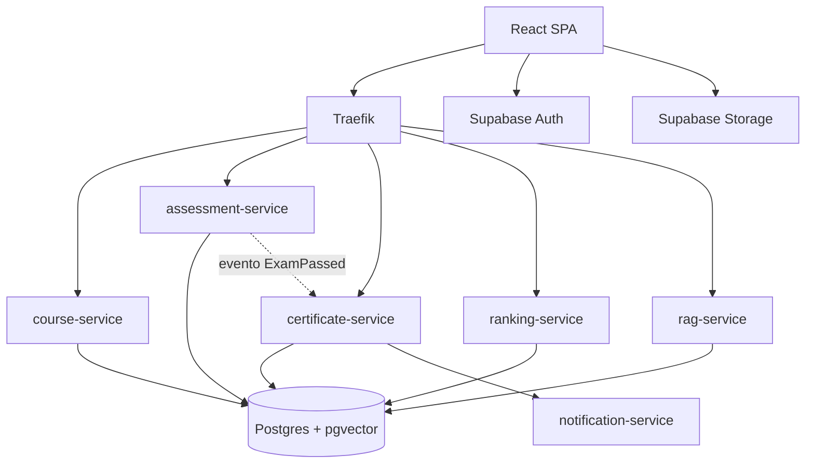
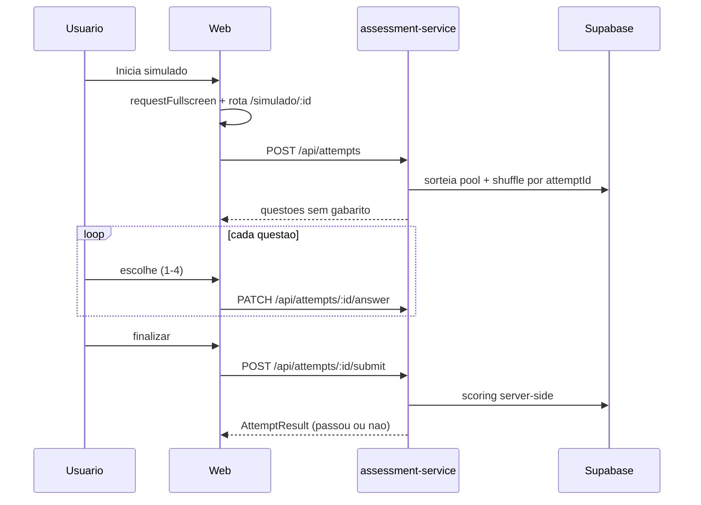

# Arquitetura — Coast Academy

Este documento descreve a arquitetura, bounded contexts e os fluxos críticos da plataforma.

> Decisões arquiteturais individuais estão em [`docs/adr/`](./adr) (formato MADR).

## Visão geral

Monorepo `pnpm` + `Turborepo` com **frontend React 19 (Vite)** e **6 microserviços NestJS** atrás de um **API Gateway Traefik**. Persistência, autenticação e storage em **Supabase** (Postgres 16 + RLS + pgvector + Auth + Storage).

## Bounded contexts

| Contexto | Serviço | Tabelas principais |
|----------|---------|--------------------|
| Curso | `course-service` | `courses`, `modules`, `chapters`, `lessons`, `lesson_progress` |
| Avaliação | `assessment-service` | `assessments`, `questions`, `question_options`, `attempts`, `attempt_answers` |
| Certificação | `certificate-service` | `certificates` |
| Ranking | `ranking-service` | `exam_rankings` |
| RAG | `rag-service` | `rag_documents`, `document_chunks` (vector) |
| Notificação | `notification-service` | (sem tabelas; é orquestrador de saída) |
| Compartilhado | (Supabase Auth) | `profiles`, `audit_log`, `app_meta` |

## Fluxo crítico: simulado fullscreen

## Fluxo crítico: aprovação na prova final

1. `assessment-service` valida `score >= 0.75`.
2. Publica evento `ExamPassed` (HTTP interno).
3. `certificate-service` gera PDF + hash SHA-256, sobe ao Storage e grava `certificates`.
4. `notification-service` envia e-mail com link assinado.
5. `ranking-service` atualiza `exam_rankings` da temporada vigente.

## Documentação relacionada

| Documento | Link |
|-----------|------|
| Registro de entregas por etapa | [`DELIVERY.md`](./DELIVERY.md) |
| ADRs (decisões arquiteturais) | [`adr/`](./adr/) |
| Segurança / Threat model | [`SECURITY.md`](./SECURITY.md) |
| Runbook (WSL, Docker, VPS) | [`RUNBOOK.md`](./RUNBOOK.md) |
| Guia de conteúdo | [`CONTENT_GUIDE.md`](./CONTENT_GUIDE.md) |

## Princípios

- **Type-safety** ponta a ponta (TS strict + Zod compartilhado).
- **Secure-by-default**: RLS deny-all, scoring server-side, gabarito não trafega.
- **Observabilidade** desde o dia 1 (Pino + OpenTelemetry).
- **Engenharia de contexto** versionada (prompts imutáveis + testes de regressão).
- **ADRs** para qualquer decisão não-trivial.
