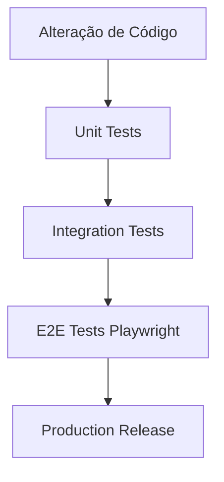

# Plano de Revisão para Melhoria de Qualidade — Coast Academy

Este documento estabelece as diretrizes de engenharia e controle de qualidade para a plataforma Coast Academy, visando garantir resiliência, manutenibilidade e alta performance no ambiente de desenvolvimento local (WSL 2) e produção.

---

## 1. Padrões de Branding Dinâmico (Configuração Centralizada)

### Problema Identificado
A presença de strings como "Felix Empire" ou "Empire Trading" espalhadas em arquivos estáticos (como códigos React e serviços NestJS) gera inconsistência visual e aumenta a probabilidade de erros durante rebrandings futuros.

### Ações Corretivas e Boas Práticas
- **Uso de Variáveis de Ambiente:** Todas as referências textuais a nomes de marca, emissores de certificado, e assinaturas de e-mail devem ser lidas a partir de variáveis de ambiente configuradas no `.env.local` (ex: `CERTIFICATE_ISSUER_NAME`, `EMAIL_FROM`, `PUBLIC_APP_NAME`).
- **Constantes Centralizadas no Frontend:** Elementos de UI fixos devem ler de constantes globais unificadas no arquivo **[constants.ts](file:///C:/Users/Marvin.costa.RJONB006401/Videos/coast-academy/apps/web/src/config/constants.ts)** para evitar replicação de strings em múltiplos componentes.
- **Internacionalização (i18n):** Todo texto traduzível deve ser extraído das páginas para os arquivos JSON de locale em `src/i18n/locales/`.

---

## 2. Estratégia de Testes e Cobertura (QA Automatizado)

Para elevar a qualidade e evitar regressões nas APIs, estabelece-se o seguinte plano de testes:



### Metas de Cobertura de Testes
- **Testes Unitários (Jest/Vitest):** Mínimo de **80% de cobertura** nas regras de negócio (Services e Helpers) nos microsserviços e no frontend.
- **Testes de Integração (NestJS + Supabase Local):** Testar fluxos de banco de dados e controle de acesso (permissões JWT, chaves anon vs service role).
- **Testes End-to-End (Playwright):** Validar os 3 fluxos críticos de ponta a ponta:
  1. Fluxo de Autenticação (Login via OTP $\rightarrow$ Verificação do link no Inbucket $\rightarrow$ Redirecionamento ao Dashboard).
  2. Conclusão Sequencial de Aulas (Aula 1 $\rightarrow$ Marcação de concluída $\rightarrow$ Desbloqueio da Aula 2).
  3. Realização da Prova Final $\rightarrow$ Aprovação $\rightarrow$ Geração do Certificado PDF $\rightarrow$ Validação Pública do QR Code.

---

## 3. Resiliência e Monitoramento no Fluxo de E-mail

O envio de e-mails transacionais (como links de login e certificados) é o canal vital de comunicação com o aluno.

### Medidas de Resiliência
- **Fallback SMTP Local:** O serviço de notificação deve suportar de forma transparente o redirecionamento de e-mails para um servidor SMTP local (Inbucket/Mailpit na porta `54325`) caso as credenciais do provedor de produção (ex: `RESEND_API_KEY`) estejam ausentes.
- **Fila de Mensageria (Retry Pattern):** Eventuais falhas na API de e-mail de produção não devem impactar a experiência imediata do usuário. Recomenda-se a implementação de um sistema de filas (como BullMQ com Redis) para tentar o reenvio gradual de e-mails falhos.
- **Métricas de Alerta no Grafana:** Monitorar a taxa de sucesso/falha do serviço de e-mail. Criar um painel de alerta no Grafana para acionar notificações caso a métrica `notification_delivery_failures_total` aumente repentinamente.

---

## 4. Otimização do Ambiente de Desenvolvimento (WSL 2)

O desenvolvimento sob WSL 2 com Docker Desktop requer configurações cirúrgicas para evitar degradação de performance do computador host (Windows).

### Configuração Recomendada do WSL 2 (`~/.wslconfig`)
Aloque recursos equilibrados para evitar swapping em disco (I/O lento) e use a recuperação automática de memória cache:
```ini
[wsl2]
memory=8GB
processors=4
autoMemoryReclaim=gradual
```

### Regra de Ouro do Sistema de Arquivos
- **Mover para o sistema Linux nativo:** Nunca execute projetos Node.js/Docker pesados dentro do caminho `/mnt/c/...` (Windows bind mount). Mova a pasta para o diretório home do WSL (ex: `~/coast-academy`). Os tempos de compilação, hot reload do Vite e operações do git ficarão **10 vezes mais rápidos**.

---

## 5. Análise Estática e Qualidade do Código

- **Husky & Lint-Staged:** Garantir que todo commit passe pelas validações de formatação do Prettier e lint do ESLint antes de entrar no controle de versão.
- **Type Checking Estrito:** Não ignorar warnings de TypeScript. O pipeline de CI deve falhar caso o comando `pnpm typecheck` encontre qualquer inconsistência de tipo.
