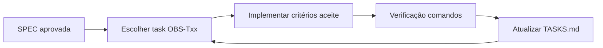

# Observabilidade — Spec-Driven Development

Este diretório segue **Spec-Driven Development (SDD)**:

1. **[SPEC.md](./SPEC.md)** — o *quê* e *por quê* (requisitos, arquitetura, DoD).
2. **[TASKS.md](./TASKS.md)** — o *como*, em tasks pequenas com verificação e dependências.

## Quick links

| Documento | Uso |
|-----------|-----|
| [SPEC-001](./SPEC.md) | Aprovar escopo antes de codar |
| [TASKS](./TASKS.md) | Executar sprint a sprint |
| [ROADMAP geral](../../ROADMAP-MELHORIAS.md#observabilidade--recomendação) | Contexto produto |

## Fluxo SDD



## Começar agora

```bash
# Stack app (se ainda não estiver no ar)
./infra/scripts/up-local.sh

# Observabilidade (LGTM + Alloy)
chmod +x infra/scripts/obs-*.sh
./infra/scripts/obs-up.sh
```

| URL | Uso |
|-----|-----|
| http://localhost:3001 | Grafana (`admin` / `admin`) |
| http://localhost:3002 | Uptime Kuma (OBS-T11) |
| http://localhost:9090 | Prometheus |
| http://localhost:8082/metrics | Traefik metrics |
| localhost:4317 / :4318 | OTLP (Alloy) |

Parar: `./infra/scripts/obs-down.sh`

**Observabilidade concluída (OBS-T01 … OBS-T14).** Smoke opcional:

```bash
./infra/scripts/obs-up.sh
./infra/scripts/verify-stack.sh --obs
```

```bash
# Métricas de certificado (OBS-T13):
./infra/scripts/verify-obs-t13.sh
```

### Dashboard Overview (OBS-T04)

Grafana → pasta **Coast Academy** → **Coast Academy Overview**

```bash
./infra/scripts/obs-smoke-traffic.sh http://localhost
```

Métricas dos serviços: `GET http://localhost:3000/metrics` (dentro do container) — após rebuild:

```bash
pnpm install
pnpm --filter @coast-academy/observability run build
./infra/scripts/coast-academy-compose.sh build certificate-service assessment-service
./infra/scripts/coast-academy-compose.sh up -d --force-recreate certificate-service assessment-service
docker exec coast-academy-certificate wget -qO- http://localhost:3000/metrics | grep http_requests_total
```

Quando pedir ao agente: *"Implemente OBS-T03 conforme SPEC-001"* — ler SPEC + task antes de codar.
